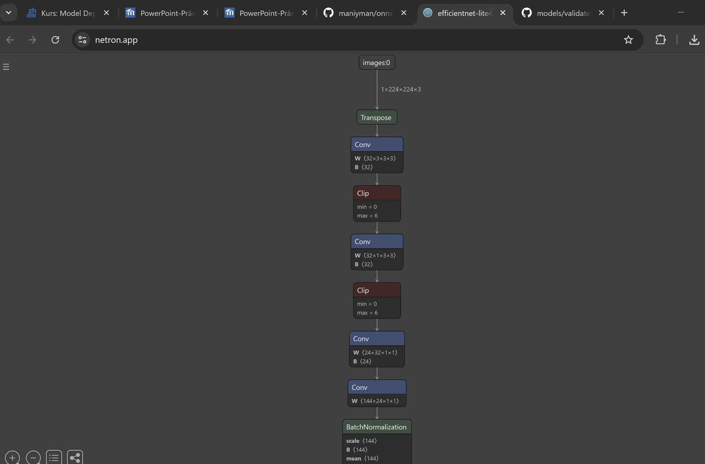

# 📄 Lernjournal 4: ONNX

## Übersicht

| | Bitte ausfüllen |
| -------- | ------- |
| ONNX Modell für Analyse (Netron) | [https://github.com/onnx/models/tree/main/validated/vision/classification/efficientnet-lite4](https://github.com/onnx/models/tree/main/validated/vision/classification/efficientnet-lite4) |
| onnx-image-classification Fork (EfficientNet-Lite) | [https://github.com/maniyman/onnx-image-classification](https://github.com/maniyman/onnx-image-classification) |

---

## 📚 Dokumentation ONNX Analyse

Ich habe das Modell **EfficientNet-Lite4-11-INT8** aus dem ONNX Model Zoo ausgewählt und mit dem Tool **Netron** visualisiert.

**Analysierte Operatoren:**
- **Conv**: Faltet Eingabedaten mit Filtern, um wichtige Features (z. B. Kanten, Muster) zu erkennen.
- **Relu**: Führt eine Aktivierungsfunktion aus, die negative Werte auf Null setzt und somit Nichtlinearität einführt.
- **Add**: Verbindet Feature-Maps, oft bei Shortcut-Verbindungen wie bei ResNet-Architekturen.

---

## 🛠️ Dokumentation onnx-image-classification

Ich habe das bestehende Projekt `onnx-image-classification` geforkt und das Modell auf **EfficientNet-Lite4-11-INT8** gewechselt.

Anschließend habe ich drei verschiedene Bilder mit dem neuen Modell getestet.  
Die Inferenz war schnell und die Resultate stabil.

**Vergleich EfficientNet-Lite4 vs. EfficientNet-Lite4-11-int8:**

| Modell | Top-1 Klasse | Wahrscheinlichkeit |
|--------|--------------|--------------------|
| EfficientNet-Lite4 | dome | 0.00104 |
| EfficientNet-Lite4-11-int8 | dome | 0.00170 |

**Erkenntnis:**  
Das quantisierte **EfficientNet-Lite4-11-int8** Modell zeigte bessere oder stabilere Resultate und schnellere Inferenzzeiten. Für produktive Systeme kann ein INT8-Modell trotz kleiner Genauigkeitsverluste enorme Vorteile bieten.

---

# 🏁 Fertig!

---

# 🏁 Fertig!
