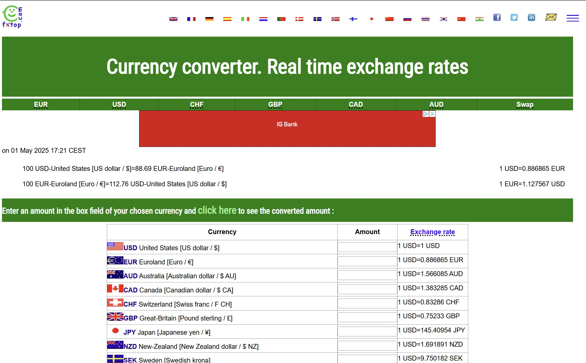
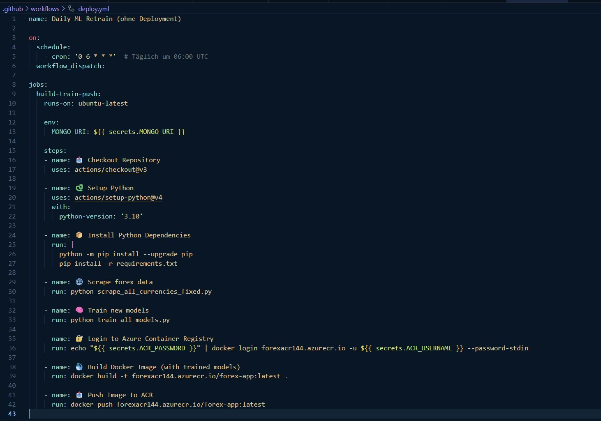
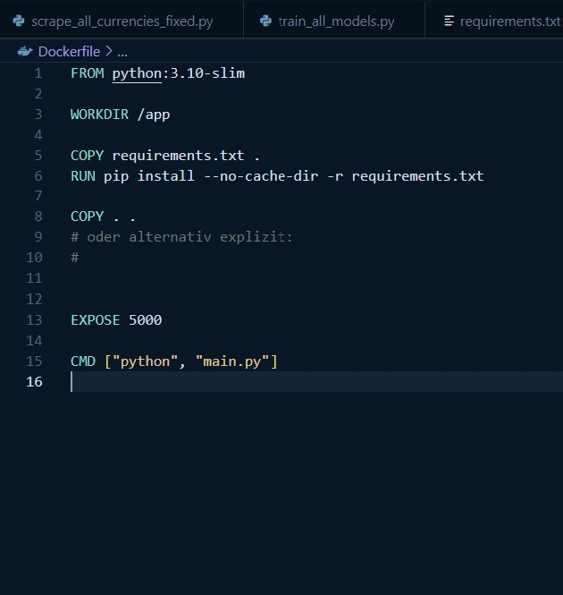
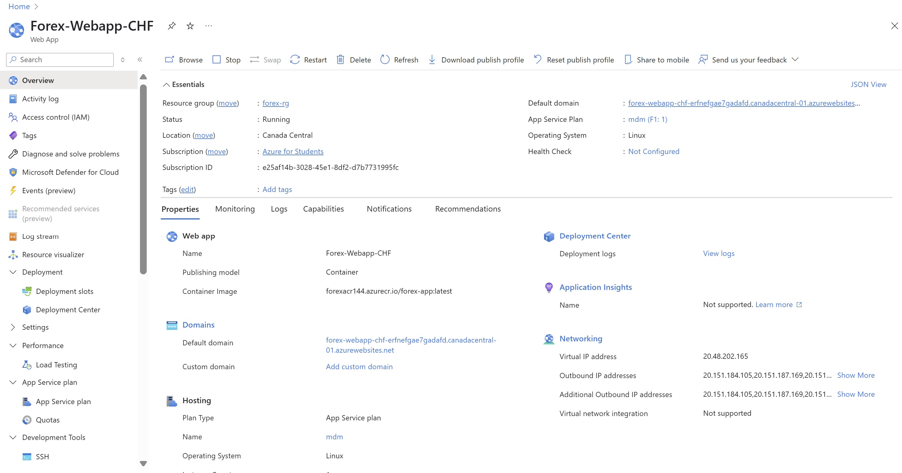

# Projekt 1 – Wechselkursprognose CHF

## Übersicht

| Bereich          | Details                                                                         |
|------------------|--------------------------------------------------------------------------------|
| Variante        | Eigenes Projekt                                                                |
| Datenherkunft  | HTML, historische Wechselkurse von fxtop.com                                   |
| Datenherkunft URL | https://fxtop.com/en/historical-exchange-rates.php                           |
| ML-Algorithmus | ARIMA (Autoregressive Integrated Moving Average)                               |
| Repo URL       | [hier deine GitHub-Repo-URL einfügen]                                           |
| Azure URL      | https://forex-webapp-chf-erfnefgae7gadafd.canadacentral-01.azurewebsites.net    |

---

## 📊 Projektbeschreibung

Diese App sagt Wechselkurse des Schweizer Franken (CHF) zu 11 Zielwährungen voraus. Sie umfasst Scraping, maschinelles Lernen, eine Web-Oberfläche und automatisiertes Deployment in der Azure-Cloud.

---

## ⚙️ Dokumentation

### 🔎 Data Scraping

- **Website:** [fxtop.com](https://fxtop.com/en/historical-exchange-rates.php)  
- **Tool:** BeautifulSoup  
- **Datei:** `scrape_all_currencies_fixed.py`  
- **Speicherung:** MongoDB  



### 🧠 Training

- **Modell:** ARIMA  
- **Datei:** `train_all_models.py`  
- **Output:** `.pkl`-Dateien im Ordner `models/`  


### 🔄 ModelOps Automation

- **Tool:** GitHub Actions  
- **Workflow:** `.github/workflows/main.yml`  
- **Prozess:** Scraping → Training → Docker Build → Push in Azure Container Registry  



### ☁️ Deployment

- **Cloud:** Azure Web App  
- **Container Registry:** forexacr144.azurecr.io  
- **Live App:** [Zur App](https://forex-webapp-chf-erfnefgae7gadafd.canadacentral-01.azurewebsites.net)  
- **Deployment:** automatisch bei Image-Push oder manuell über Azure CLI  




---

## ✅ Setup-Anleitung (optional)

1. `.env`-Datei anlegen (wird in `.gitignore` ausgeschlossen)
2. Lokale Umgebung einrichten:
   ```bash
   pip install -r requirements.txt
   ```
3. Scraper ausführen:
   ```bash
   python scrape_all_currencies_fixed.py
   ```
4. Modelle trainieren:
   ```bash
   python train_all_models.py
   ```
5. Docker-Image bauen:
   ```bash
   docker build -t forex-app .
   ```
6. Image pushen & Azure-WebApp neu starten.
