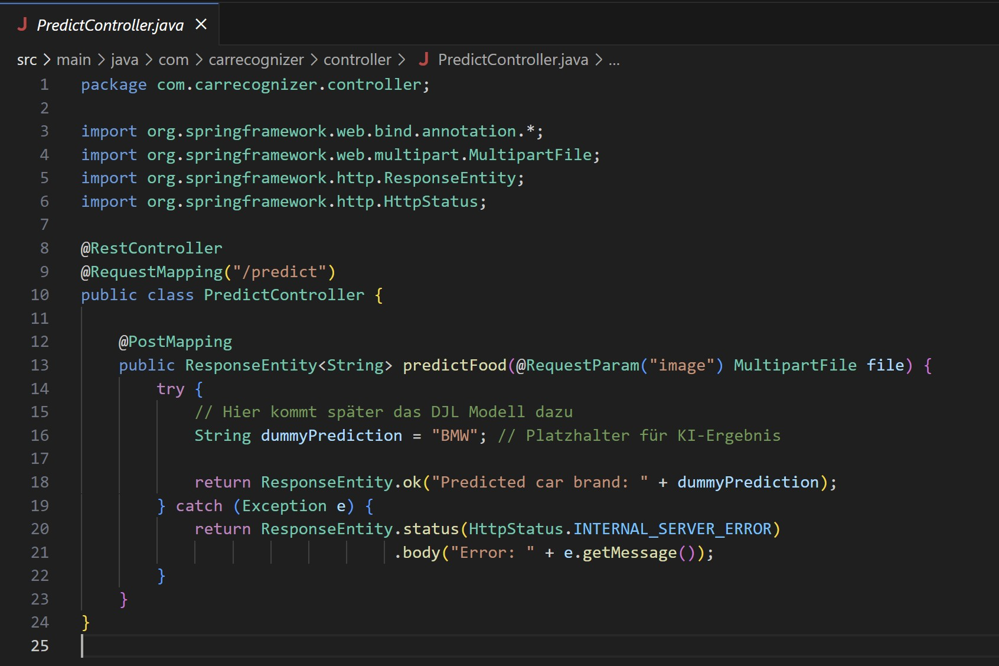
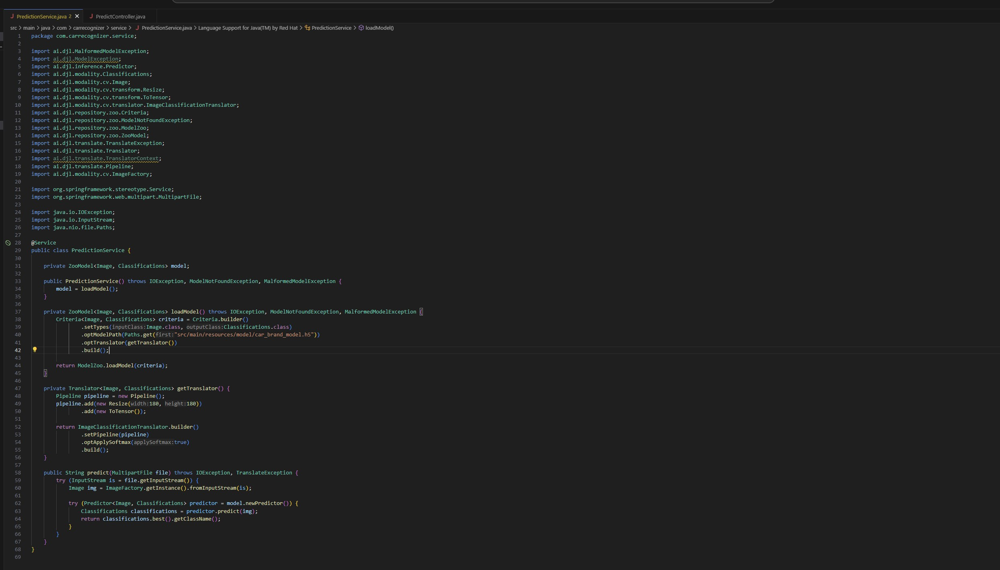
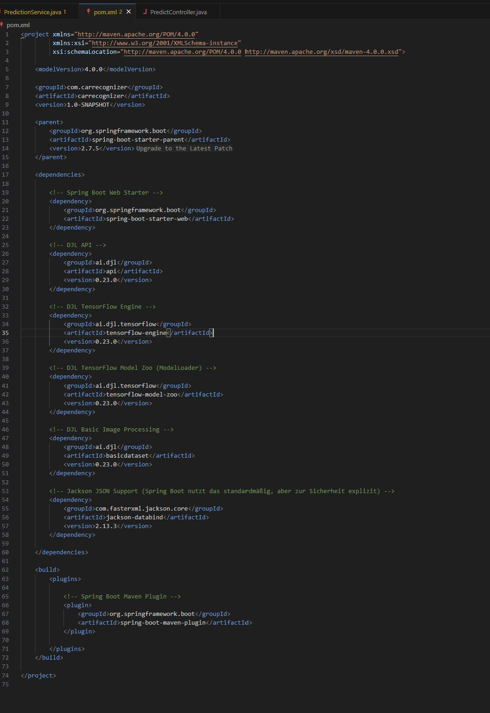
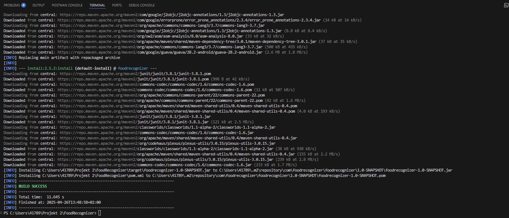
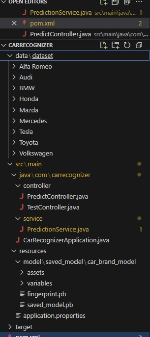

# Projekt 2 – Car Recognizer (Java + TensorFlow)

## Übersicht

| Kategorie                  | Inhalt                                                                 |
|----------------------------|------------------------------------------------------------------------|
| **Variante**               | Vorhandenes Modell + Eigener Datensatz                                |
| **Datensatz (selbstgewählt)** | Format: Bilddaten (.jpg, .png) Beschreibung: Bilder von Automarken (BMW, Audi, Mercedes, etc.), ca. 100 Bilder pro Marke |
| **Datensatz URL**          | Nicht öffentlich – eigene Sammlung und Quellen wie Google/Bing Images |
| **Modell URL**             | Nicht öffentlich – lokal trainiertes TensorFlow SavedModel            |
| **ML-Algorithmus**         | Convolutional Neural Network (CNN) mit TensorFlow                     |
| **Repo URL**               | [https://carrecognizer-fkh5cscmdvf7hcex.southindia-01.azurewebsites.net](https://carrecognizer-fkh5cscmdvf7hcex.southindia-01.azurewebsites.net) |

---

## 📁 Daten

- Eigener Datensatz mit Bildern von verschiedenen Automarken
- Erweiterung durch Data Augmentation (Flip, Rotation, Zoom)

---

## ⚙️ Training

- CNN-Modell mit TensorFlow
- Optimizer: Adam
- Loss: Categorical Crossentropy
- ca. 10 Epochen Training mit über 25.000 Bildern

---

## 🤖 Inference / Serving

- Eingebunden in ein Spring Boot Backend (Java)
- REST API Endpoint `/predict` zur Bildklassifikation
- Modell wird beim Start aus `src/main/resources/model/` geladen

---

## 🚀 Build & Deployment

- Maven Build (`mvn clean package`)
- Dockerized Anwendung (`Dockerfile` mit Java + Python + TensorFlow)
- Bereitstellung via Azure Container Registry (ACR) und Azure App Service
- Zugriff über Azure App URL:  
  [https://carrecognizer-fkh5cscmdvf7hcex.southindia-01.azurewebsites.net](https://carrecognizer-fkh5cscmdvf7hcex.southindia-01.azurewebsites.net)

